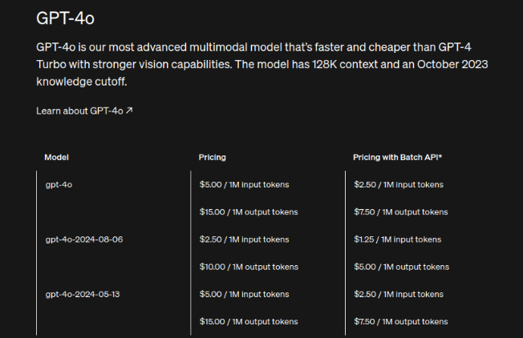
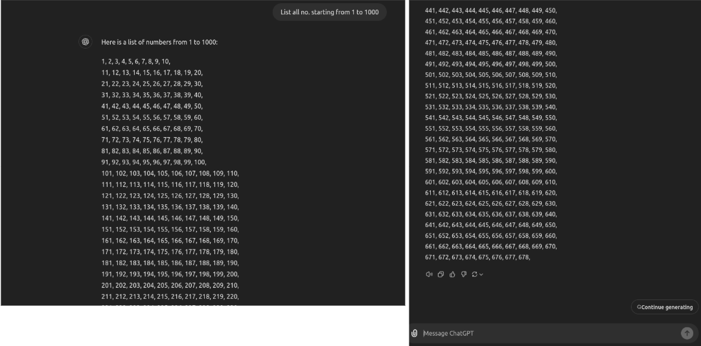
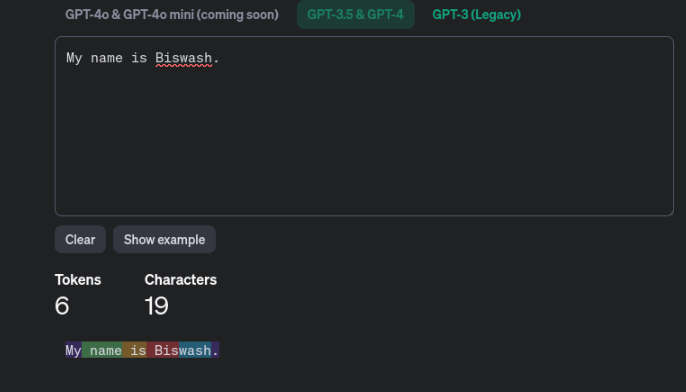
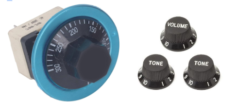

# 🚀 Day 14 - Exploring LLM Parameters and Tokenization

This repository documents my 60-day learning journey through **Data Science** and **Machine Learning**.

---

## 📌 Today's Focus:
Today, I explored key concepts related to **Large Language Models (LLMs)** — specifically **parameters** and **tokenization**. I also looked into **GPT-4o's pricing** and **context window** limits.

---

## 💡 GPT-4o Pricing

Let’s begin with the pricing of GPT-4o:

---

## 🧠 What is a Context Window?

A **context window** refers to the **maximum number of tokens** a model can handle in a single input.  
- For example: **ChatGPT 3.5** has a limit of **4096 tokens**.  
- If the input exceeds this, it will be **truncated**, and the model might ask to "continue."

---

## ✍️ Words vs Tokens

LLMs process language using **tokens**, not words.

> ✅ **Token**: A unit of text — could be a word, part of a word, or punctuation.  
> ✅ **Words**: Human-readable components of language.  
> 🧠 While 100 words may seem simple, they could translate into 120–200 tokens.

---

## 🔄 Tokenization vs Tokenizer

| Concept        | Explanation                                                                 |
|----------------|-----------------------------------------------------------------------------|
| **Tokenization** | The process of splitting text into manageable units (tokens).               |
| **Tokenizer**    | The algorithm or tool that performs tokenization.                          |

This segmentation is essential for models to process **linguistic data efficiently**.

> 🧩 Token counts affect:
> - Model training data
> - Context windows
> - Inference cost
> - Output length

---

## 💸 Why Tokenization Matters

- LLMs operate on tokens, not words.
- The **cost and speed** of using LLMs depend heavily on **token count**.
- Always check **what tokenizer is being used** when working with different models.

---

## 🧮 What Exactly Are Parameters?

From the world of **statistics**:

> A **parameter** is a constant value used inside a mathematical model.

Suppose, you want to :- Predict some variable y depending on some other variable x with a linear model. 

Assumption :- 
*	The model is linear

Model 	:-
*	y = a * x + b

Parameters in Model :- 
*	a and b . (Two parameters) 

Since, input (x) are the constant and independent,Inputs are not parameters. 

What if the model is not linear ?  What if quadratic? 
Assumption :- 
*	The model is quadratic

Model 	:-
*	y = a * x2 + b * x + c

Parameters in Model :- 
*-	a, b and c. (Three parameters) 

------------------------------------------------------------------------------------------------------------------------

## Mathematical Functions :- Can be of any nature 

Assumption:-
	(let’s assume a polynomial function of order n)

Machine Learning Models :- 
ML models are essentially still the same 
	- a mathematical function that maps some input vector to some output vector.
	- And the term "parameters" still refers to the constants that function depends on,
		like a and b in the previous examples. 
	- ML models just have far more of these parameters, typically millions.
			(how quickly ; 3 parameters to 1,000,000 (1M) )

Parameters are the levers and knobs in the math machine you use to turn inputs into outputs. Inputs are not parameters. 

------------------------------------------------------------------------------------------------------------------------

## 🤖 In Machine Learning

ML models = **Functions** that map inputs to outputs:

- Inputs are **not** parameters.
- Parameters are the **levers and knobs**.
- LLMs (like GPT) have **billions** of parameters.

---

## 🔧 What Are LLM Parameters?

LLM parameters are the **adjustable settings** that affect how text is generated.

| Parameter           | Effect                                                                             |
|---------------------|------------------------------------------------------------------------------------|
| `temperature`       | Controls randomness. Higher = more random/creative outputs.                        |
| `top-p` (nucleus)   | Controls diversity. Model picks from top probabilities adding up to p (e.g., 0.9). |
| `max_tokens`        | Limits output length.                                                              |
| `presence_penalty`  | Discourages repetition of new topics.                                              |
| `frequency_penalty` | Discourages repetition of same phrases.                                            |

They influence:
- **Quality** (accuracy, relevance)
- **Diversity** (variety in responses)
- **Creativity** (novelty in outputs)

---

## 🧾 Summary

- Tokens are the fundamental units of processing in LLMs.
- Token count affects **context**, **cost**, and **output**.
- Parameters guide how LLMs generate and control language.
- Understanding tokenization and parameters is key to using LLMs efficiently.

---

## 📄 More Resources

📄 View the full notes and visuals in Google Docs:  
👉 [Click to open](https://docs.google.com/document/d/1M9rmOgYQ6vrN4UqbJ32yBgZVBJNsXzyfLcCqARL9Lp8/edit?usp=sharing)

---

📅 **#Day14** of my #60DaysOfLearning  
🔗 Stay tuned for more insights into AI, ML, and NLP!
------------------------------------------------------------------------------------------------------------------------